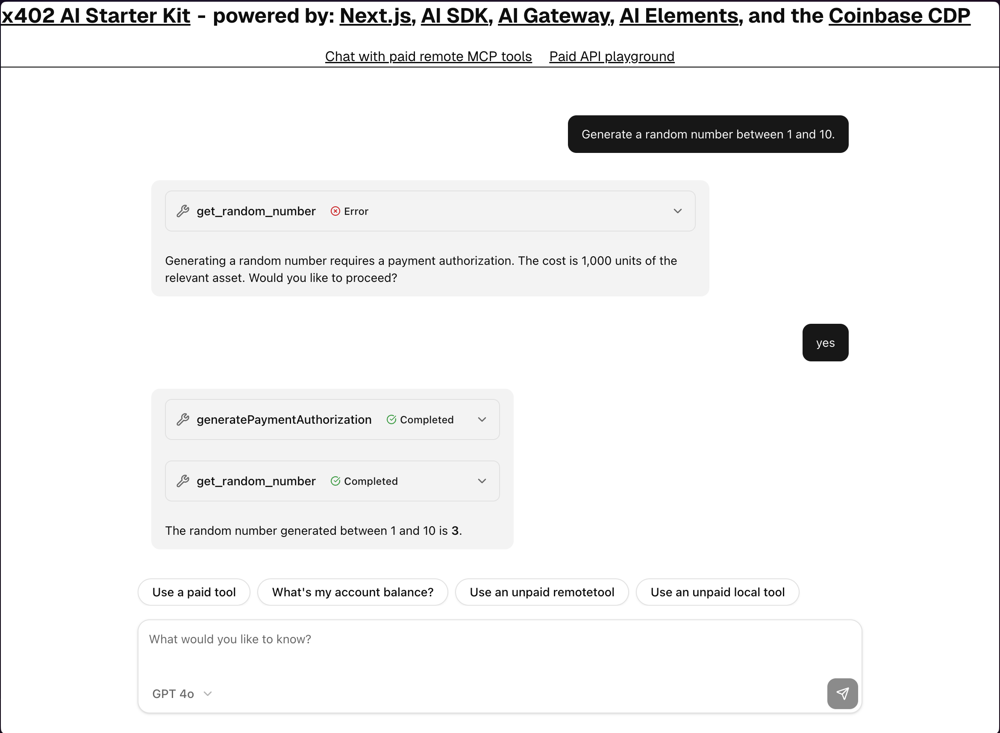

# x402 Next.js + AI Starter Kit

[](https://vercel.com/new/clone?repository-url=https%3A%2F%2Fgithub.com%2Fvercel-labs%2Fx402-ai-starter&env=CDP_API_KEY_ID,CDP_API_KEY_SECRET,CDP_WALLET_SECRET&envDescription=Coinbase%20Developer%20Platform%20credentials%20are%20needed%20to%20create%20and%20fund%20server%20wallets&envLink=https%3A%2F%2Fdocs.cdp.coinbase.com%2Fapi-reference%2Fv2%2Fauthentication&project-name=x402-ai-starter&repository-name=x402-ai-starter&demo-title=x402%20AI%20Starter&demo-description=A%20fullstack%20template%20for%20using%20x402%20with%20MCP%20and%20AI%20SDK&demo-url=https%3A%2F%2Fx402-ai-starter.labs.vercel.dev%2F&demo-image=https%3A%2F%2Fx402-ai-starter.labs.vercel.dev%2Fscreenshot.png)



[x402](https://x402.org) is a new protocol built on top of HTTP for doing fully accountless payments easily, quickly, cheaply and securely.

This template built with [Next.js](https://nextjs.org), [AI SDK](https://ai-sdk.dev), [AI Elements](https://ai-elements.dev), and direct AI provider APIs (OpenAI, Anthropic, Google) and the [Coinbase CDP](https://docs.cdp.coinbase.com/) shows off using x402 with a modern AI stack.

**Demo: [https://x402-ai-starter.vercel.app/](https://x402-ai-starter.vercel.app/)**

## Features

- **Multi-Provider AI Support**: Choose from OpenAI, Anthropic (Claude), or Google AI models
- **AI Chat + API Playground**: Interactive chat interface with x402 payment integration
- **AI Agent with Paid Tools**: MCP server with tools that cost real money (USDC)
- **Paywalled APIs**: Secure API endpoints that require payment
- **Paywalled Pages**: Content protected for bots/scrapers
- **Secure Server Wallets**: Coinbase CDP-managed wallets with automatic funding

## Tech Stack

- [Next.js](https://nextjs.org/) - React framework with App Router
- [AI SDK](https://ai-sdk.dev) - Unified AI model interface
- [AI Elements](https://ai-elements.dev) - AI-powered UI components
- [OpenAI API](https://platform.openai.com/) - GPT models
- [Anthropic API](https://console.anthropic.com/) - Claude models
- [Google AI API](https://makersuite.google.com/) - Gemini models
- [Coinbase CDP](https://docs.cdp.coinbase.com/) - Server-managed wallets
- [x402](https://x402.org) - Accountless payments protocol
- [MCP](https://modelcontextprotocol.io/) - Model Context Protocol

## Getting Started

```bash
git clone https://github.com/vercel-labs/x402-ai-starter
cd x402-ai-starter
pnpm install
```

## Running Locally

1. Sign into the [Coinbase CDP portal](https://portal.cdp.coinbase.com)

2. Following `.env.example`, set the following environment variables in `.env.local`:

**Required for payments:**
- `CDP_API_KEY_ID` - Your Coinbase Developer Platform API key ID
- `CDP_API_KEY_SECRET` - Your Coinbase Developer Platform API key secret
- `CDP_WALLET_SECRET` - Your Coinbase Developer Platform wallet secret

**Required for AI functionality:**
Choose one AI provider and set its API key:
- `AI_PROVIDER` - Set to `openai`, `anthropic`, or `google` (defaults to `openai`)
- `OPENAI_API_KEY` - From [OpenAI Platform](https://platform.openai.com/api-keys)
- `ANTHROPIC_API_KEY` - From [Anthropic Console](https://console.anthropic.com/)
- `GOOGLE_GENERATIVE_AI_API_KEY` - From [Google AI Studio](https://makersuite.google.com/app/apikey)

**Note:** You only need the API key for your chosen provider. The app supports switching between providers by changing the `AI_PROVIDER` environment variable.

**Optional:**
- `NETWORK` - Set to `base-sepolia` (testnet) or `base` (mainnet), defaults to `base-sepolia`

3. Run `pnpm dev`

4. Open [http://localhost:3000](http://localhost:3000) in your browser to see the app in action.

## Testing Payments

By default, the app uses the `base-sepolia` network, or "testnet". This is a testing network with fake money. The app is configured to automically request more funds from a faucet (source of testnet money) when your account is running low. You can also do this yourself in the [Coinbase CDP dashboard](https://portal.cdp.coinbase.com/products/faucet?token=USDC&network=base-sepolia).

## Going to Production

When you're ready to deploy your SaaS application to production, follow these steps:

### Deploy to Vercel

1. Push your code to a GitHub repository.
2. Connect your repository to [Vercel](https://vercel.com/) and deploy it.
3. Follow the Vercel deployment process, which will guide you through setting up your project.

### Add environment variables

In your Vercel project settings (or during deployment), add all the necessary environment variables. Make sure to update the values for the production environment, including:

**Required for payments:**
- `CDP_API_KEY_ID` - Your Coinbase Developer Platform API key ID
- `CDP_API_KEY_SECRET` - Your Coinbase Developer Platform API key secret
- `CDP_WALLET_SECRET` - Your Coinbase Developer Platform wallet secret

**Required for AI functionality:**
- `AI_PROVIDER` - Set to `openai`, `anthropic`, or `google`
- `OPENAI_API_KEY` - Your OpenAI API key
- `ANTHROPIC_API_KEY` - Your Anthropic API key
- `GOOGLE_GENERATIVE_AI_API_KEY` - Your Google AI API key

**Note:** You only need the API key for your chosen provider. The app supports switching between providers by changing the `AI_PROVIDER` environment variable.

**Optional:**
- `NETWORK` - Set to `base` for mainnet production

## Moving to mainnet

To move to mainnet, set the `NETWORK` environment variable to `base`.

Make sure that the `Purchaser` account has enough funds to pay for the tools you're using. To fund the account, you can send USDC to the account's address in the [Coinbase CDP dashboard](https://portal.cdp.coinbase.com/products/server-wallet?accountType=evm-eoa).
